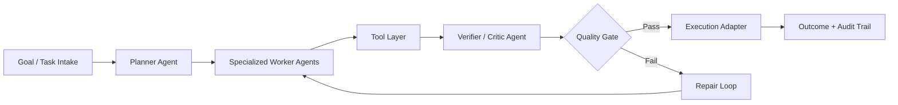

# Demario Asquitt

**AI Engineer focused on Agent Systems.** I build production-grade, tool-using AI systems that can plan, execute, verify, and improve work autonomously.

I specialize in **Multi-Agent Orchestration**, **RAG workflows**, and reliability-first backend architecture using **FastAPI, Celery, Redis, and PostgreSQL**.

## What I Build

- **Agent orchestration systems**: planner-worker-validator loops, task routing, approval-aware execution, and replayable transcripts.
- **Tool-using agents**: web research, structured data extraction, document analysis, and platform action layers.
- **Production reliability**: idempotent execution paths, failure recovery, observability, and contract-safe APIs.
- **Platform-agnostic automation**: execution patterns that generalize across CMS and infrastructure differences without brittle hardcoding.

## How My Agent Systems Run

## Featured Projects

### [research-agent-system](https://github.com/asquitt/research-agent-system)
A collaborative multi-agent research system where planner, researcher, validator, and synthesizer agents work together using real tools.
It matters because it demonstrates how to turn raw LLM capability into repeatable decision-quality outputs with verification.
Technical depth: async orchestration, extensible tool interfaces, source validation, and cost-aware execution controls.

### [govtech-sniper](https://github.com/asquitt/govtech-sniper)
An AI-powered B2B platform for ingesting, qualifying, and drafting citation-backed responses to U.S. government opportunities.
It matters because it compresses high-friction proposal workflows from weeks to hours while preserving compliance rigor.
Technical depth: large-context LLM pipelines, Celery-based background processing, structured compliance extraction, and traceable citations.

### [cove](https://github.com/asquitt/cove)
An ADHD-friendly iOS app that uses AI to classify captured input into actionable workflows while protecting user privacy.
It matters because it applies AI to a high-empathy, behavior-sensitive product where UX and safety both have to be first-class.
Technical depth: SwiftUI + SwiftData architecture, actor-based services, PII redaction before LLM calls, and on-device voice processing.

### [distributed-kv-store](https://github.com/asquitt/distributed-kv-store)
A fault-tolerant distributed key-value store built from scratch around consensus and durability principles.
It matters because strong AI systems still rely on strong systems fundamentals under failure and partial network conditions.
Technical depth: Raft-oriented design, gRPC-based node communication, and durability patterns inspired by production systems like etcd/Consul.

## Current Work: Orbitr (SEO Product)

At [Orbitr](https://www.getorbitr.com), I focus on the **SEO product** in an autonomous AI marketing platform:

- Build and ship SEO agent workflows that move from discovery to execution with minimal manual intervention.
- Engineer reliability across asynchronous agent execution paths using FastAPI, Celery, Redis, and PostgreSQL.
- Design platform-agnostic automation patterns that work across GitHub Pages, WordPress, Shopify, and Webflow.
- Partner across product, engineering, and AI research to improve outcome quality, observability, and deployment safety.
- Light GEO exposure: collaborated on work that aligns search optimization with emerging generative engine visibility patterns.

## Recruiter Signal Snapshot

| Area | Evidence |
|---|---|
| **Problem types solved** | Multi-step reasoning workflows, autonomous execution systems, retrieval + synthesis pipelines, and reliability hardening for AI features. |
| **Production constraints handled** | Async job orchestration, failure recovery, idempotency, auditability, API contract enforcement, and cross-platform execution variance. |
| **Execution ownership** | End-to-end from architecture and implementation through verification, release, and post-deploy iteration. |
| **Systems/platforms operated** | FastAPI services, Celery workers, Redis/PostgreSQL, TypeScript frontends, and multi-platform website integrations. |
| **Collaboration style** | Operates at the intersection of product strategy, AI research direction, and pragmatic software engineering delivery. |

## Let's Connect

- LinkedIn: [linkedin.com/in/demario-asquitt](https://linkedin.com/in/demario-asquitt)
- Email: [demarioasquitt@gmail.com](mailto:demarioasquitt@gmail.com)
- Website: [getorbitr.com](https://www.getorbitr.com)
